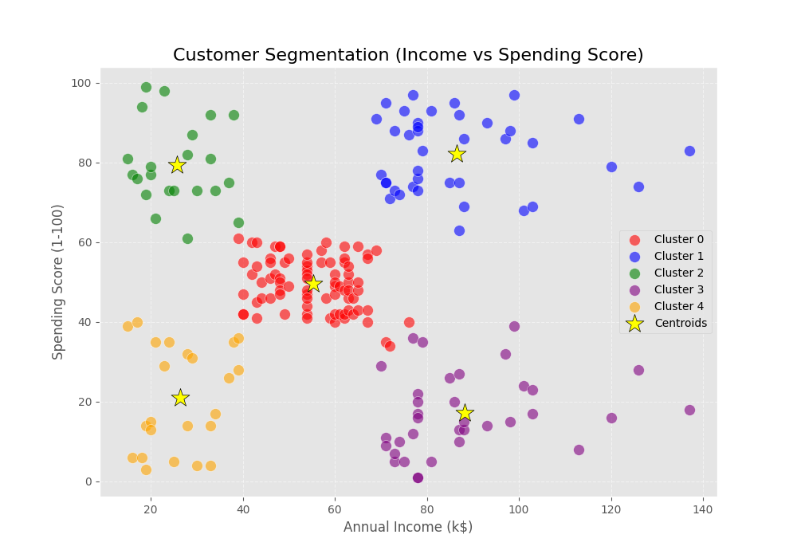

# Customer Segmentation using K-Means Clustering



## Project Overview
This project is part of the **Synent Technologies Data Science Internship (Task 6)**. It focuses on performing customer segmentation using K-Means clustering. By analyzing purchasing behavior and demographic data, we can divide the customer base into actionable segments.

## Problem Statement
A mall wants to understand its customers better to target them with personalized marketing campaigns. They have collected data on customer age, gender, annual income, and a proprietary "Spending Score" (1-100). The objective is to identify distinct customer groups based on their income and spending behavior.

## Objectives
- Perform comprehensive Data Cleaning and Exploratory Data Analysis (EDA).
- Engineer features and apply scaling appropriate for distance-based clustering.
- Determine the optimal number of clusters using the Elbow Method and Silhouette Score.
- Train a K-Means clustering model to segment the customers.
- Provide actionable, data-driven business insights based on the identified segments.

## Dataset Information
The dataset used is the **Mall Customer Segmentation Data** (originally from Kaggle).
- `CustomerID`: Unique ID assigned to the customer.
- `Gender`: Gender of the customer.
- `Age`: Age of the customer.
- `Annual Income (k$)`: Annual income of the customer in thousands of dollars.
- `Spending Score (1-100)`: Score assigned by the mall based on customer behavior and purchasing data.

## Technologies Used
- **Python 3.x**
- **Pandas & NumPy** (Data Manipulation)
- **Matplotlib & Seaborn** (Data Visualization)
- **Scikit-Learn** (Machine Learning & Clustering)
- **Jupyter Notebook** (Analysis Environment)

## Project Workflow
1. **Introduction & Setup:** Importing libraries and loading data.
2. **Data Cleaning:** Handling nulls, duplicates, and standardizing columns.
3. **Exploratory Data Analysis (EDA):** Visualizing distributions and relationships.
4. **Feature Engineering:** Extracting Income and Spending Score, followed by StandardScaler.
5. **Model Building:** Finding optimal $K=5$ using WCSS (Elbow) and Silhouette Scores, followed by K-Means training.
6. **Cluster Interpretation:** Assigning business definitions to each cluster.
7. **Business Recommendations:** Proposing marketing strategies for each segment.

## Installation
1. Clone the repository:
   ```bash
   git clone https://github.com/S-TarakRamReddy/Customer-Segmentation.git
   cd Customer-Segmentation
   ```
2. Install the required dependencies:
   ```bash
   pip install -r requirements.txt
   ```
3. Run the Jupyter Notebook:
   ```bash
   jupyter notebook Customer_Segmentation.ipynb
   ```

## Results
The algorithm successfully identified **5 distinct customer segments**:
1. **Premium Customers**: High Income, High Spend
2. **Target / High Potential**: Low Income, High Spend
3. **Standard Customers**: Mid Income, Mid Spend
4. **Conservative Customers**: High Income, Low Spend
5. **Budget Shoppers**: Low Income, Low Spend

## Business Insights
By targeting the **Premium** and **Target** customers with VIP programs and high-engagement campaigns, the mall can maximize revenue. Conversely, **Conservative Customers** should be targeted with value-driven, durable goods to increase their spending score. See the Jupyter Notebook and the Project Report for full details.

## Future Improvements
- Integrate additional data such as transaction history or online shopping behavior.
- Use advanced algorithms like DBSCAN or Hierarchical Clustering to capture non-spherical groups.
- Perform multi-dimensional clustering by incorporating `Age` into the segmentation.

## Repository Structure
```text
Customer-Segmentation/
├── Customer_Segmentation.ipynb
├── README.md
├── mall_customers.csv
├── requirements.txt
├── LICENSE
├── .gitignore
├── images/
│   ├── elbow_method.png
│   ├── clusters.png
│   ├── distributions.png
│   └── pairplot.png
├── docs/
│   └── project_report.md
└── submission_materials/
    ├── DEMO_SCRIPT.md
    └── LINKEDIN_POST.md
```

## Author
**Tarak Ram Reddy**  
*Synent Technologies Data Science Intern*
